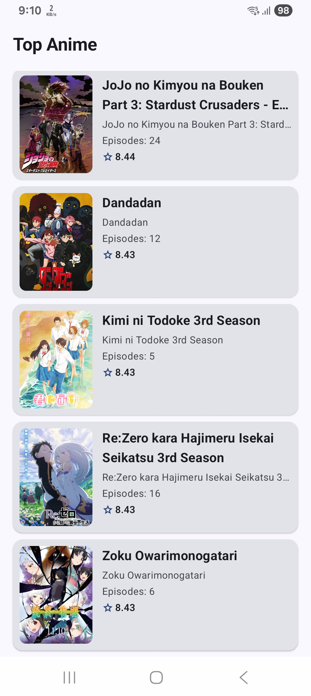
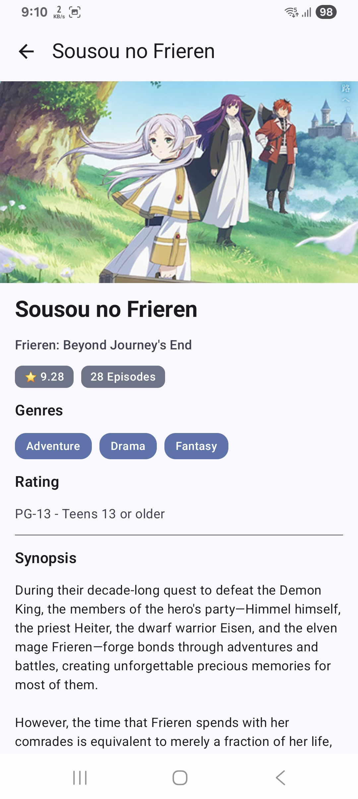
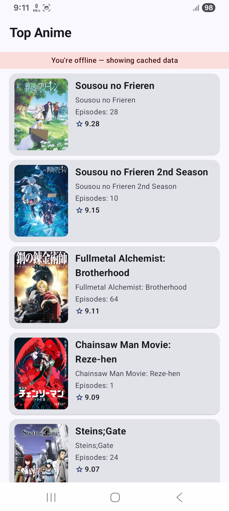

# AnimeApp

An Android app built as a take-home assignment for **Seekho**. It uses
the [Jikan API](https://jikan.moe/) to fetch and display top-rated anime with full offline support.

---

## Screenshots & Demo

| Anime List                               | Anime Detail                                  | Offline Mode                                       |
|------------------------------------------|-----------------------------------------------|----------------------------------------------------|
|  |  |  |

---

## APK Download

[Download APK](https://drive.google.com/file/d/1aeGwc95lDioZOXFvfquQziVjfFeb5Q-C/view?usp=sharing)

---

## Features Implemented

### Anime List Screen

- Fetches and displays the top anime list from the Jikan API
- Each item shows poster image, title, episode count, and MAL score
- Swipe-to-refresh to sync latest data from the network
- Infinite scroll pagination — next page loads automatically when 6 items remain in view
- Offline banner shown when the device has no internet connection

### Anime Detail Screen

- Tap any anime card to open the detail screen
- Shows trailer (embedded YouTube via WebView), poster fallback when no trailer is available, title,
  synopsis, genres, episodes, score, and content rating
- Cached detail is served instantly when offline

### Offline-First

- Room database is the single source of truth; UI always observes local DB via `Flow`
- On app launch with no internet, cached data is shown immediately with an offline banner
- On swipe-to-refresh with no internet, cached data is preserved — nothing gets wiped
- Refresh uses a `@Transaction` (clear + insert atomically) to avoid any flash of empty state

### Error Handling

- All API calls go through a `safeApiCall` wrapper that maps responses to a `NetworkResult` sealed
  class (`Success`, `Error`, `Exception`)
- `CancellationException` is rethrown properly to respect coroutine cancellation
- UI shows distinct states: `Loading`, `Success`, `Empty`, `Error`

---

## Architecture

Three Gradle modules following Clean Architecture:

```
app/        → UI layer (Jetpack Compose, Navigation, ViewModels)
domain/     → Business logic (UseCases, Repository interfaces, Domain models)
data/       → Data layer (Retrofit, Room, Repository impl, DataSources)
```

### MVVM + Repository + Offline-First

- **ViewModel** exposes `StateFlow<UiState>` to the Compose UI
- **UseCase** classes hold single business operations and are injected into ViewModels
- **Repository** owns the page cursor, coordinates remote and local sources, and decides when to
  replace local data
- **RemoteDataSource / LocalDataSource** wrappers isolate Retrofit and Room from the repository

### Dependency Injection

Hilt is used throughout, with all infrastructure components scoped to `SingletonComponent`.

### Pagination

Manual pagination without the Jetpack Paging library:

- `currentPage` lives in `AnimeRepositoryImpl`, resets on refresh, increments only on a successful
  network response
- The list detects when 6 or fewer items remain via `derivedStateOf` on `LazyListState` and triggers
  `loadNextPage()`
- A `PaginationState(isLoadingMore, hasReachedEnd)` guard in the ViewModel prevents duplicate API
  calls

---

## Libraries Used

| Library                               | Purpose                             |
|---------------------------------------|-------------------------------------|
| Jetpack Compose + Material 3          | UI toolkit                          |
| Navigation Compose (type-safe routes) | Screen navigation                   |
| Hilt                                  | Dependency injection                |
| Retrofit + Kotlinx Serialization      | Network requests & JSON parsing     |
| OkHttp + Logging Interceptor          | HTTP client & debug logging         |
| Room                                  | Local database (offline cache)      |
| Coil                                  | Async image loading                 |
| Kotlinx Coroutines + Flow             | Async operations & reactive streams |
| `kotlinx-coroutines-test`             | Unit testing coroutines             |

---

## Assumptions Made

1. **Multi-module by layer, not by feature** — the project is split into `app`, `domain`, and `data`
   modules following a layer-based approach. Since the scope is small, splitting by
   feature (e.g. `:feature:animeList`, `:feature:animeDetail`) would add unnecessary module overhead
   without a meaningful build or scalability benefit at this size.

2. **Coil for image loading** — Coil was chosen over Glide/Picasso because it's built with Kotlin
   and Coroutines`, and also support for lifecycle-aware loading.

2. **UseCase layer added** — I added a
   dedicated UseCase layer to keep ViewModels thin and demonstrate clean architecture more clearly.

3. **No ExoPlayer integration** — the assignment asked for a trailer player, but integrating
   ExoPlayer/Media3 properly goes beyond the time constraint so didn't implemented it.

4. **Pagination does not resume after coming back online** — if the device is offline, pagination is
   paused. When connectivity restores, the user needs to pull-to-refresh to reset and reload from
   page 1. Automatic background sync on reconnect is not implemented.

6. **Genres stored as a comma-separated string in Room** — Room doesn't natively support
   `List<String>` columns without a TypeConverter. Genres are joined as `"Action,Adventure"` in the
   entity and split back on read, which keeps the schema simple.

---

## Project Structure

```
app/
└── feature/
    ├── animeList/
    │   ├── AnimeListScreen.kt
    │   ├── AnimeListViewModel.kt
    │   └── components/AnimeListItem.kt
    └── animeDetail/
        ├── AnimeDetailScreen.kt
        └── AnimeDetailViewModel.kt

domain/
├── model/          → Anime, AnimeDetail, PaginationInfo
├── repository/     → AnimeRepository (interface)
├── usecase/        → FetchAnimeListUseCase, GetAnimeDetailUseCase, ObserveAnimeListUseCase
├── core/           → ConnectivityManager (interface)
└── util/           → Mapper<T>

data/
├── remote/
│   ├── dto/        → AnimeDto, AnimeDetailDto, response wrappers
│   ├── datasource/ → AnimeRemoteDataSource
│   └── util/       → SafeApiCall, NetworkResult
├── local/
│   ├── dao/        → AnimeDao, AnimeDetailDao
│   ├── entity/     → AnimeEntity, AnimeDetailEntity
│   ├── datasource/ → AnimeLocalDataSource
│   └── mapper/     → Entity ↔ Domain extension functions
├── repository/     → AnimeRepositoryImpl
├── core/           → ConnectivityManagerImpl, DispatcherProvider
└── di/             → NetworkModule, LocalStorageModule, RepositoryModule, CoreModule
```

---

## Running the App

1. Clone the repository
2. Project built with **Android Studio Panda 2 | 2025.3.2**
3. Kotlin **2.3.10** · AGP **9.1.0** · Gradle **9.4**
4. Run on a device or emulator with **API 26+**
